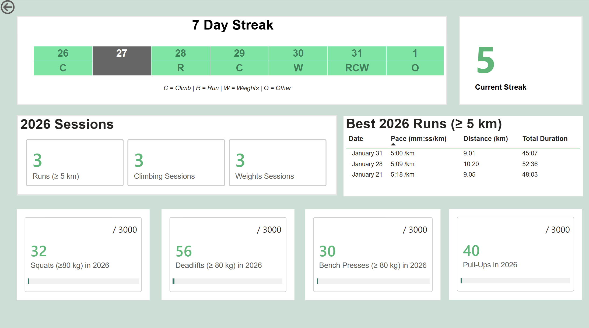
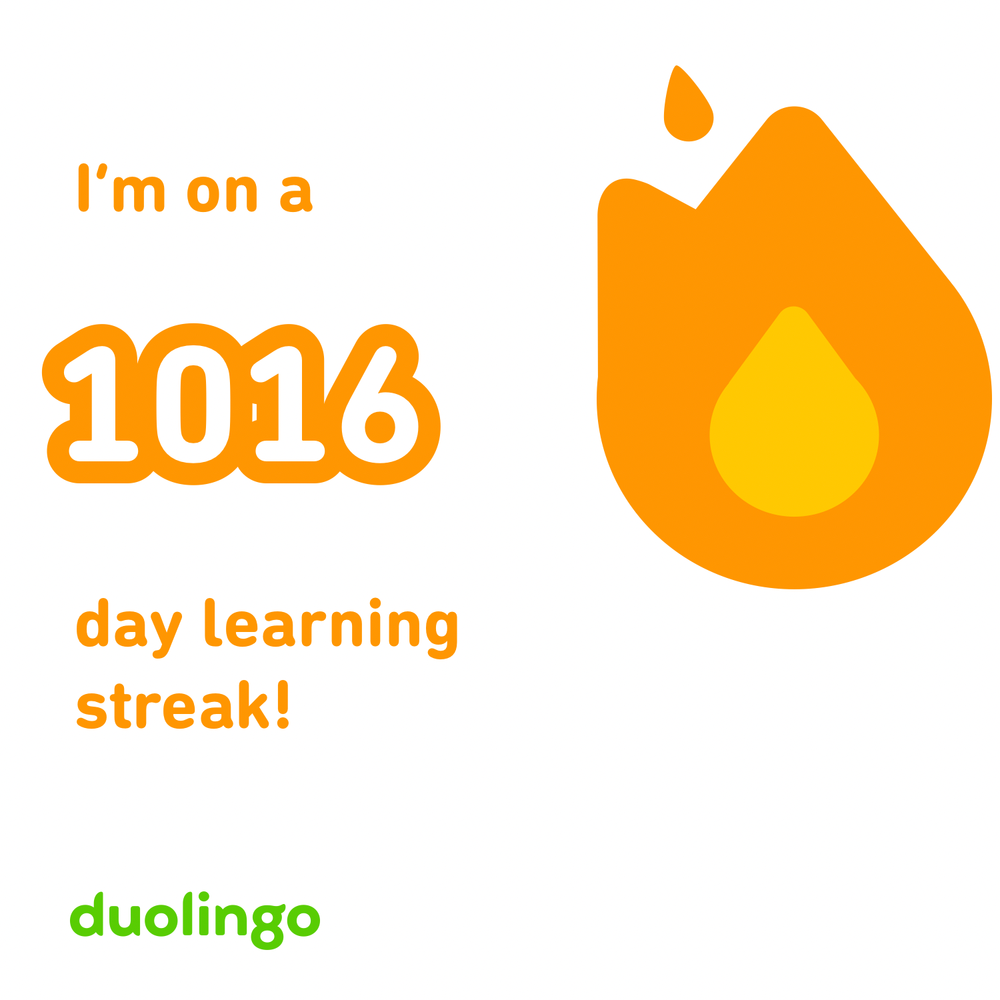
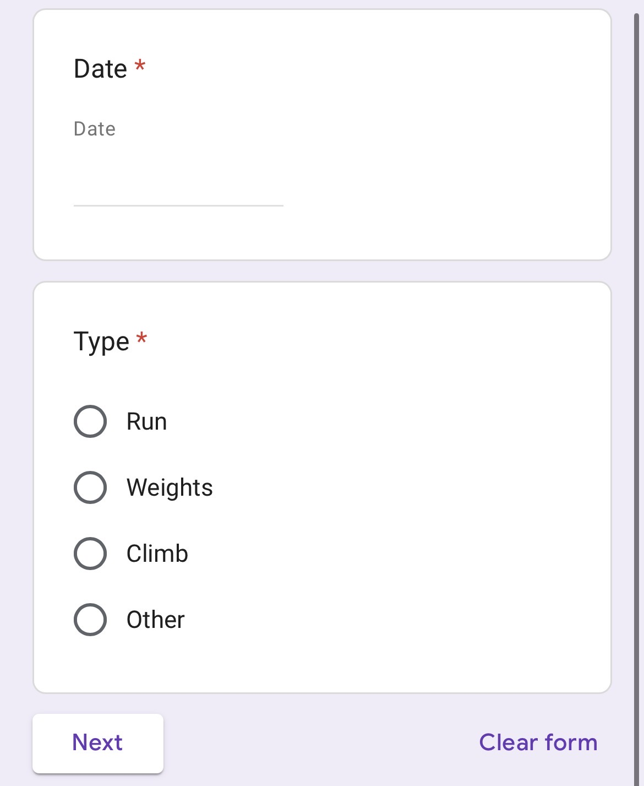
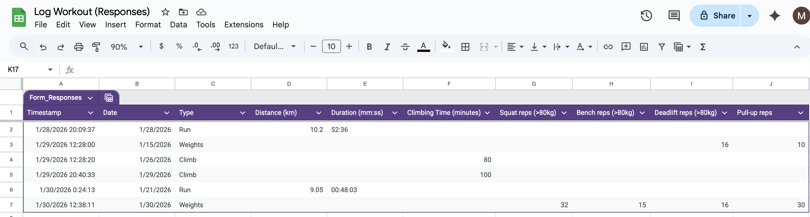

# From iPhone tap to dashboard: a streak-based fitness tracker in Power BI

  

December 2025 and January 2026 flew by: travel, Christmas, then moving cities. My routine took a hit, and I realised I'd like to show up a lot more consistently this year.

So I'm borrowing a trick from something that _does_ keep me consistent: Duolingo. Duolingo users will do almost anything to protect a streak. I wanted that same “don’t break the chain” motivation for fitness.

  

<small><em>Inspiration: Duolingo’s streak mechanic for consistency.</em></small>

The goal is simple: do something every day while prioritising cardio, strength, and climbing.
The streak continues with a qualifying run (≥ 5 km), climb, or lift, and deliberately includes “Other” activities (e.g. tennis) to keep the system sustainable.

The question was: *can I build a streak I actually want to maintain, using a lightweight data pipeline and a dashboard I’ll check daily?*

---

## Setting
My fitness data was scattered:
- running lived in Strava/Garmin  
- strength sessions lived in iPhone notes  
- climbing lived… mostly in memory  

That made it hard to track progress in one place, especially around the metric that matters most to me: consistency.

I wanted four things:
- **A streak tracker** (move daily)
- **Yearly targets for lifting** (so the streak isn’t “Other” forever)
- **Low logging friction** (fast enough to do every day)
- **A framework that rewards consistency over intensity**

For strength, I set **rep-count targets** for squat / bench / deadlift / pull-ups. Rough on purpose: think ~100 lifting days × ~30 reps.

---

## Action

### 1) One-tap logging from my iPhone (Google Form pinned to home screen)

  
  &nbsp;&nbsp;&nbsp;
  

<small><em>Quick-entry logging: one tap from the home screen → date + activity (plus lightweight fields).</em></small>

### 2) Responses land in Google Sheets (simple data store)

  

<small><em>Form responses captured in Google Sheets (simple “data store” for Power BI to ingest).</em></small>

### 3) Power BI ingests the sheet and calculates the streak + progress-to-goal

  

<small><em>Streak tracking, 2026 sessions, best runs (≥ 5 km), and progress-to-goal tiles.</em></small>

I deliberately avoided ingesting Strava/Garmin data to keep the approach lightweight and low-maintenance.

On the build side, the fun parts were:
- modelling the activity log cleanly (one row per session/day)
- a streak measure that updates based on consecutive qualifying days
- progress-to-goal tiles for yearly rep targets
- a “Best 2026 runs ≥5km” table driven by pace + distance

---

## Outcome
It’s simple enough that I actually use it and that’s the win. January wasn’t the consistent start I wanted (moving cities), which is exactly why the streak mechanic helps.

**Next target:** build toward a 365-day streak.

If you’re building habit dashboards too, I’d love to hear what metrics you track.
